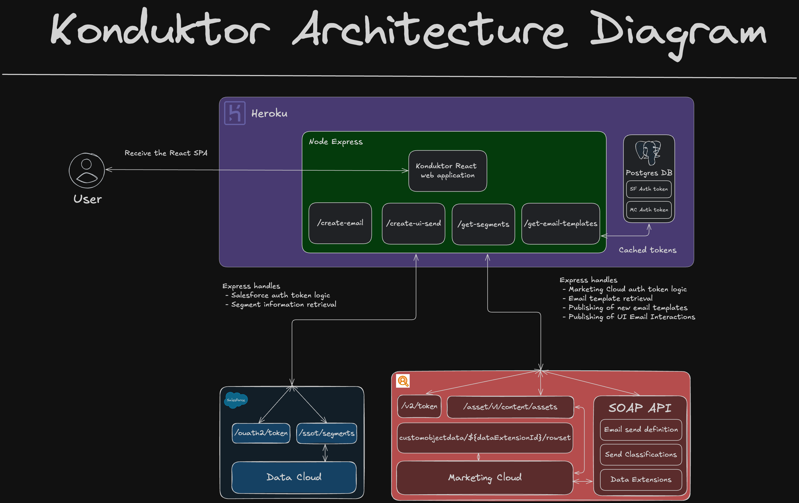
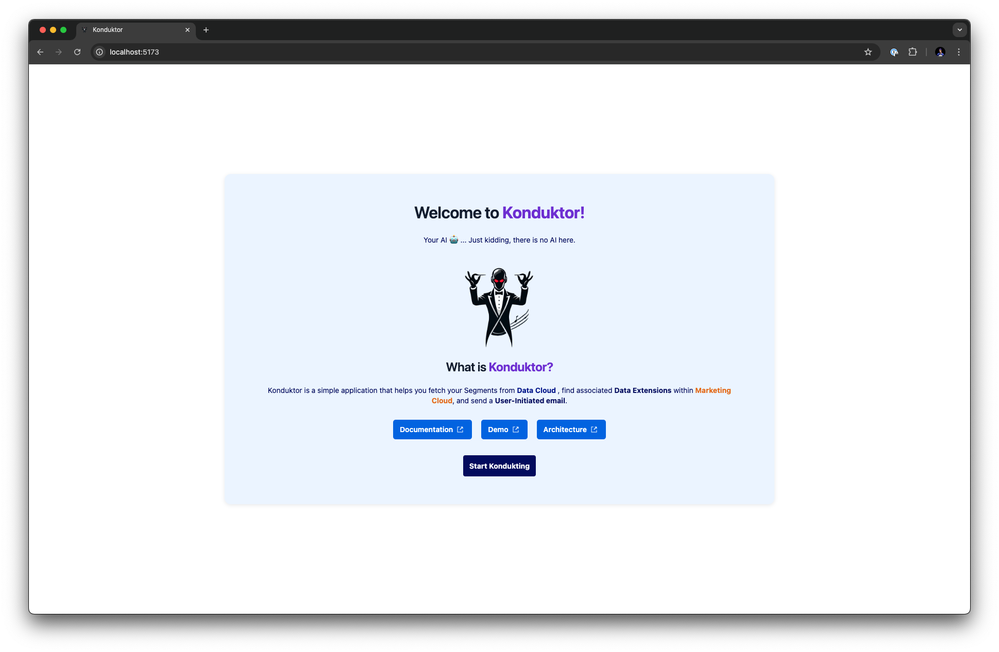
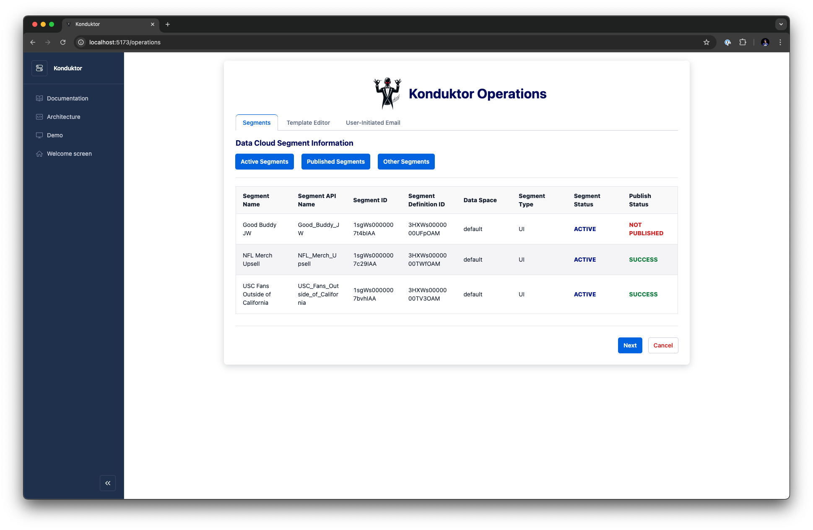
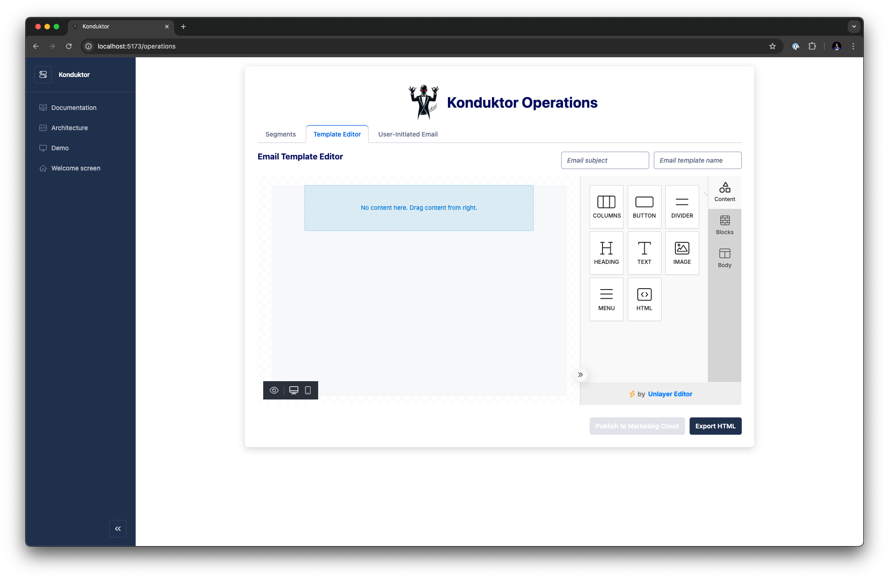
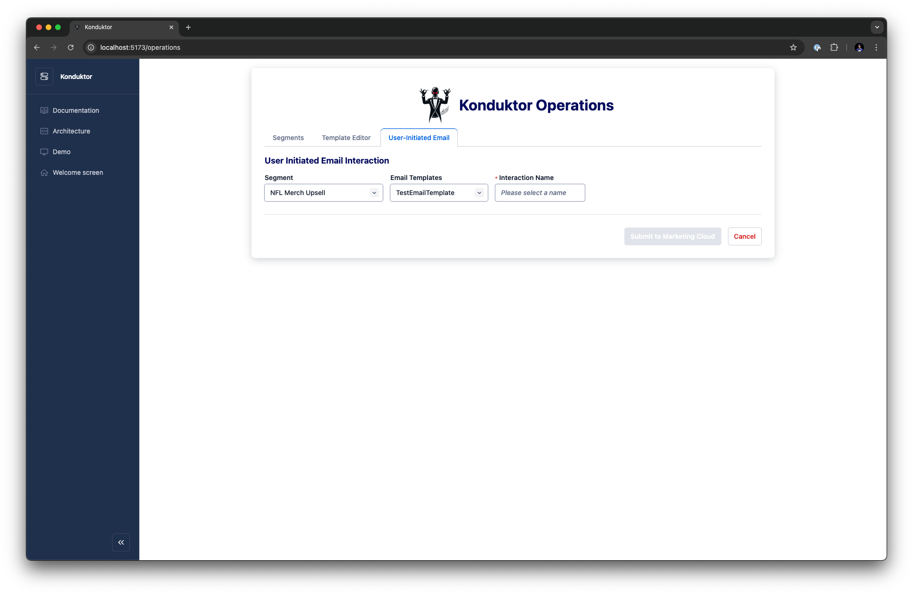

<p align="center">
<a  href="https://www.salesforce.com/"></a>
<a  href="https://www.salesforce.com/data/"></a>
<a  href="https://www.salesforce.com/form/sem/marketing-cloud-demo-overview"></a>
<p/>

# Konduktor - Data Cloud & Marketing Cloud

**Konduktor** is a project designed to integrate Salesforce's Data Cloud and Marketing Cloud, providing a unified platform for viewing Data Cloud Segment information, creating of custom email templates, and creating User Initiated Email Interactions in Marketing Cloud. This project allows you to leverage the strengths of both clouds in a custom React application which can be further customized to fit various business use cases.

# Table of Contents

- [Konduktor - Data Cloud \& Marketing Cloud](#konduktor---data-cloud--marketing-cloud)
- [Table of Contents](#table-of-contents)
  - [How does it work?](#how-does-it-work)
    - [Architecture diagram](#architecture-diagram)
  - [User Interface Demo](#user-interface-demo)
  - [Welcome page](#welcome-page)
  - [Segments](#segments)
  - [Template Editor](#template-editor)
  - [User-Initiated Email](#user-initiated-email)
  - [Technologies used](#technologies-used)
- [Configuration](#configuration)
  - [Requirements](#requirements)
  - [Setup](#setup)
    - [Development](#development)
    - [Deployment](#deployment)
      - [Can I deploy this anywhere else other than Heroku?](#can-i-deploy-this-anywhere-else-other-than-heroku)
- [Kudos](#kudos)
- [License](#license)
- [Disclaimer](#disclaimer)

---

## How does it work?

### Architecture diagram



## User Interface Demo


## Welcome page



## Segments



## Template Editor



## User-Initiated Email



## Technologies used

- [JavaScript](https://developer.mozilla.org/en-US/docs/Web/JavaScript)
- [Node.js](https://nodejs.org/en)
- [Express](https://expressjs.com/)
- [React](https://react.dev/)
- [Twilio Paste](https://paste.twilio.design/)
- [Heroku Postgres](https://elements.heroku.com/addons/heroku-postgresql)

For a more detailed overview of the development & production dependencies, please check `package.json`.

# Configuration

## Requirements

To run this application locally, you will need the following:

- An active Salesforce account with Data Cloud provisioned
- An active Marketing Cloud with Marketing Cloud Engagement
- Node.js version 20 or later installed (type `node -v` in your terminal to check). Follow [instructions](https://nodejs.org/en/download) if you don't have node installed
- npm version 10.0.0 or later installed (type `npm -v` in your terminal to check). Node.js includes `npm`
- git installed. Follow the instructions to [install git](https://git-scm.com/downloads)
- A [Heroku account](https://signup.heroku.com/)
- A Heroku [Postgres addon](https://elements.heroku.com/addons/heroku-postgresql)

## Setup

The first step is to clone the repository and install the project dependencies for both server and client folders via a terminal interface by running the `npm install` in the proper folder:

Client:

```
cd salesforce-data-cloud-marketing-cloud-konduktor
cd client
npm install
```

Server"

```
cd salesforce-data-cloud-marketing-cloud-konduktor
cd server
npm install
```

The second step is to create a `.env` file in the root of the project by copying `.env.example` file.

```
cp .env.example .env
```

Edit the newly created `.env` file and update the variables with your account specific information. For details on creating a Salesforce token, please visit the [official documentation](https://help.salesforce.com/s/articleView?id=sf.connected_app_create.htm&type=5).

```
# Salesforce Core credentials
SERVICE_USER_USERNAME=
SERVICE_USER_PASSWORD=
CLIENT_ID=
CLIENT_SECRET=
SERVICE_USER_SECURITY_TOKEN=
SALESFORCE_LOGIN_URL=https://login.salesforce.com
SALESFORCE_INSTANCE_URL=
SALESFORCE_API_VERSION=v61.0

# Salesforce Marketing Cloud credentials
SFMC_CLIENT_ID=
SFMC_CLIENT_SECRET=
SFMC_AUTH_URL=
SFMC_SOAP_ENDPOINT=
SFMC_ACCOUNT_ID=
SFMC_SUBDOMAIN=

#Database credentials
DATABASE_USER=
DATABASE_PASSWORD=
DATABASE_HOST=
DATABASE_PORT=
DATABASE_NAME=
```

NOTE: If you want to deploy this application to Heroku, you will have to create all of the above variables as Heroku environment variables. This can be done via the [command line or the Heroku Dashboard UI](https://devcenter.heroku.com/articles/config-vars).

Once all of this is done, you are ready to run the application locally!

### Development

To run the application locally, use the command line, navigate to the server and client folder, ensure the dependencies are installed properly, and run the following:

Server:

```
cd salesforce-data-cloud-marketing-cloud-konduktor
cd server
npm run dev
```

Client:

```
cd salesforce-data-cloud-marketing-cloud-konduktor
cd client
npm run dev
```

This will automatically run the Express development server. Your client app will run on `http://localhost:5173` and the server will be available at `http://localhost:3000`.

When you make changes to your code, the server will automatically restart to fetch new changes.

### Deployment

Once you are happy with your application, you can deploy it to Heroku!

To deploy the application to Heroku, please follow the [official instructions](https://devcenter.heroku.com/articles/git).

#### Can I deploy this anywhere else other than Heroku?

Absolutely! The only reason why Heroku is used here is because it is owned by Salesforce and at the moment of creating this I am a Salesforce employee.

NOTE: Don't forget to re-create the environment variables in Heroku as the `.env` file will be ignored.

# Kudos

Special thank you to cousin brother [Wade Shiflett](https://github.com/WRSSF) and angry Mikuman [Mikuk Konsolas](https://github.com/mikachu2222).

# License

[MIT](http://www.opensource.org/licenses/mit-license.html)

# Disclaimer

This software is to be considered "sample code", a Type B Deliverable, and is delivered "as-is" to the user. Salesforce bears no responsibility to support the use or implementation of this software.
